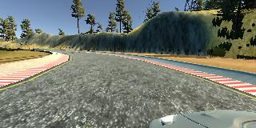
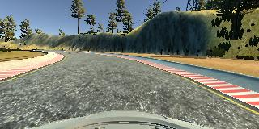
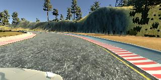
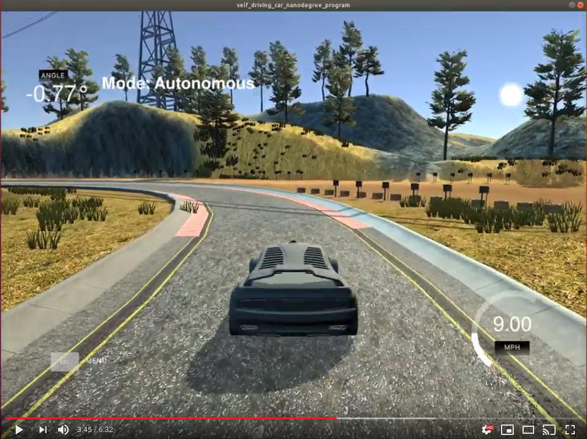

# Behavioral Cloning Project

The Project
---
The goals / steps of this project are the following:
* Use the simulator to collect data of good driving behavior 
* Design, train and validate a model that predicts a steering angle from image data
* Use the model to drive the vehicle autonomously around the first track in the simulator. The vehicle should remain on the road for an entire loop around the track.
* Summarize the results with a written report

The simulator can be downloaded [here](https://github.com/udacity/self-driving-car-sim)

Data Collection
---
Using the simulator, in training mode, drive manually and record data of the vehicle driving by using the record function. This will output a left side, centered, and right side image along with a .csv file that maps each trio of images to their steering angle, throttle, brake, and speed. This data is in the folder DrivingData2. (Could not submit project with data, it was too large)

  

The images and corresponding steering angles where added into the lists images, measurments. This makes the images the training data with the measurements as the labels.

The data collected for the final trained model was roughly 2.5 counter clockwises laps trying to stay in the center of the road as much as possible. In addition about 1 counter clockwise lap of zig zag from one end of the lane to the other for the entire lap. This zig zag lap helped the model learn how to recover and go back closer to the center and remain there.

The Model
---
The model was build using [keras](https://keras.io/) with tensor flow. It can be found in cell 11. 

The architecture was based on an architecture previously used by the nvidia team.

| Layer         | Description                  |
|---------------|------------------------------|
|Input          | 160x320x3 image              |
|Normalize      |                              |
|Cropping       | Crop the image 70 pixels on the top and 25 pixels in the bottom|
|Convolutional  | Filter=24, 5x5 Convolution, Activation=RELU, Strides=(2,2)|
|Convolutional  | Filter=36, 5x5 Convolution, Activation=RELU, Strides=(2,2)|
|Convolutional  | Filter=48, 5x5 Convolution, Activation=RELU, Strides=(2,2)|
|Convolutional  | Filter=64, 3x3 Convolution, Activation=RELU|
|Convolutional  | Filter=64, 3x3 Convolution, Activation=RELU|
|Dropout        |                              |
|Flatten        |                              |
|Fully connected| Output 100                   |
|Fully connected| Output 50                    |
|Fully connected| Output 10                    |
|Fully connected| Output 1                     |

Each image was cropped to focuse directly on the road rather than the sections off the road or the hood of the vehicle. I introduced a droput layer to help prevent overfitting. An adam optimizer was used with a mean squared error. 

The data was split 20% to 80% for validation and training data.

The model was saved as nvidia_relu_multiplelaps_recoverylap_noAugment_model.h5 instead of the standard model.h5.

Once I had a decent working model and parameter tunning wasn't as effective anymore, I focused on collecting more and better data. The final approach to the final data used is described in the previous data section.

Autonomous Mode
---
The trained model was used to drive the vehicle using the drive.py file and putting the simulator in autonomous mode to view how the model is driving the vehicle.

I used the video.py to make a video of how my model drove the vehicle, this video is the run1.mp4. The quality is not that great, however I also took a video using the RecordMyDesktop app. Link bellow:

